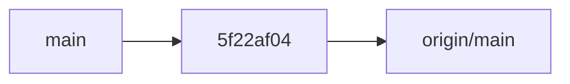
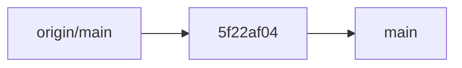
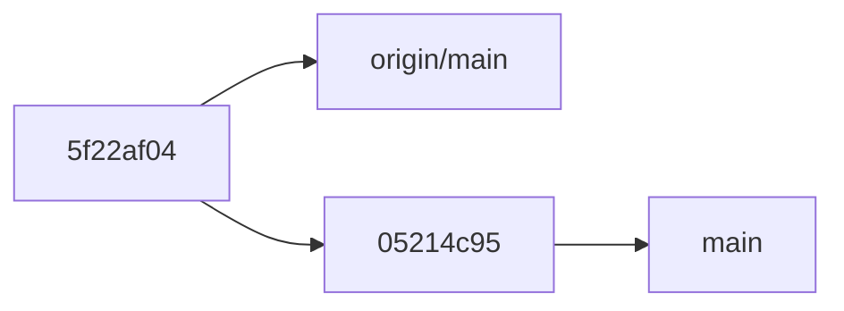

# git-branch-assistant

**git-branch-assistant** is a command line application to manage your git repositories and synchronize branches with their upstreams. There are many other tools with similar functionality[^1]; this one is built to support the workflow I personally prefer. I use it together with my [assistant](../assistant/) tool, but it can be used as a standalone program.

## Git cleanup

The `git-branch-assistant clean` command cleans up branches in the git repository of the current working directory.

It compares each branch to its upstream and takes different actions depending on the current state. It uses the following
command to list each branch along with its upstream - try it out in your git repository:

```
$ git branch "--format=%(refname:short):%(upstream:short)"
```

The output may look like this:

```
main:origin/main
my-feature:origin/my-feature
new-branch:
```

We see that there is a `main` branch with the upstream `origin/main`, a `my-feature` branch with the upstream `origin/my-feature` and a `new-branch` branch without an upstream.

For each pair of local branch and its upstream, one of the following situations are possible. 

### No upstream

If you have a branch that you, for example, have just created locally, it does not have an upstream.  We see this above with the `new-branch` branch.

For this situation, `git-branch-assistant` provides the following options:

* Push and create pull request [default choice]
* Push to create origin
* Delete it
* Show git log
* Exit to shell with branch checked out
* Do nothing

### Branches are identical

When the local branch is pointing to the same commit as its upstream, there is nothing to do and we just continue processing the branches. 

### Upstream is ahead

Let's say the situation for `main` and its upstream looks like this.



The origin is two commits ahead of our local main – you can read the arrows as illustrating the relation "is the parent of". (In reality, it is rather the child commit that is "pointing to" the parent, but it feels more natural to illustrate it this way somehow.)

Whenever the local branch is an _ancestor_ of its upstream, we can fast-forward the local branch to the upstream. `git-branch-assistant` will do this using `git rebase`, which in this case has the same effect as a fast-forward pull, but can be done on a branch other than the one currently checked out.

### Local branch is ahead

The opposite situation to the above is when the local branch is ahead of its upstream. 



Here, the natural thing to do is to push the local branch to the upstream. `git-branch-assistant` will however stop for an interactive confirmation in this step, and show the following options:

* Push to origin (default)
* Show git log
* Exit to shell with branch checked out
* Do nothing

### Diverged branches

When it is neither the case that the local branch is an ancestor of the upstream nor the opposite, the branches have diverged. 



In this case, we need to decide how to proceed. In my personal workflow, this is not a very common scenario. 
I usually do any commits on feature branches that only I work on. But it happens that I will use a feature like
Github's "merge in main" or there will be a suggested-fix-commit from a coworker on a pull request branch. 
The most common thing I will want to do then is to rebase the local branch on the upstream branch, so that's the default choice.

### Upstream is set, but it doesn't exist

The last situation is when the local branch has an upstream set, but it doesn't exist.
This usually happens when a pull request has been merged, so the default suggestion will be to remove the local branch.

## Git repos management

The `git-branch-assistant repos` command provides batch management for multiple git repositories. When run from a directory containing multiple git repositories (as subdirectories), it will:

1. Scan all subdirectories in the current directory
2. Check each directory to see if it's a git repository
3. For each repository, check its status:
   - **Branches needing action**: Repositories where branches need syncing with upstreams are automatically processed using the same logic as `clean`

This command is particularly useful when you maintain multiple related repositories and want to ensure they're all in a clean, synchronized state. It will interactively handle any repositories that need attention, allowing you to quickly clean up branches across your entire workspace.

### Listing branches across repos

Pass `--list` to skip the cleaning flow and instead print one row per local branch found across every repo, sorted by the date of the latest commit (oldest first):

```
$ git-branch-assistant repos --list
2023-08-12  no upstream  alice    repo-a/old-experiment
2024-01-04  diverged     alice    repo-b/feature-x
2024-09-20  ok           bob      repo-c/main
```

Add `--interactive` (`-i`) to pick a branch from the list. The selected branch is checked out in its repo, and the repo path is written to the suggested-cd file (just like the existing flow), so a shell wrapper can `cd` into it.

In interactive mode the listing is also cached under `~/.cache/skagedal-tools/git-branch-assistant/branches/` (or `$XDG_CACHE_HOME/skagedal-tools/...`), keyed by the directory the command was invoked from. If a fresh cache (less than an hour old) is available, the picker opens immediately on the cached data, runs a background rescan with a `Refreshing...` indicator, and updates the list in place when the rescan finishes — keeping the cursor on the same branch when it still exists, or falling back to the first entry otherwise.

### Bulk actions

Pass `--bulk` to group all branches across the scanned repos by their upstream state (no upstream, upstream ahead, local ahead, diverged, upstream gone) and apply actions to many branches at once.

```
$ git-branch-assistant repos --bulk
```

For each non-clean state with at least one branch, a multi-select picker opens:

```
Upstream is set, but it is gone (3/3 selected)
  ↑/↓ j/k navigate, space toggle, a toggle all, ←/→ h/l action, Enter confirm, Esc cancel
> [x] repo-a/old-feature
  [x] repo-b/merged-pr
  [x] repo-c/done
[Delete it]   Show git log    Exit to shell    Do nothing
```

- Up/Down (or `j`/`k`): move the cursor between branches
- Space: toggle the highlighted branch (all are selected by default)
- `a`: toggle every branch
- Left/Right (or `h`/`l`): switch action — listed in the same order they appear in the per-branch flow
- Enter: apply the chosen action to every selected branch
- Esc / `q`: skip the rest of this state group

A few actions only make sense for one branch at a time (`Show git log`,
`Exit to shell with branch checked out`). When such an action is highlighted,
the checkboxes disappear and Enter applies the action to just the branch under
the cursor. Switching back to a bulk action restores the previous selections.

When `Push and create pull request` is confirmed for one or more branches, a
second screen appears with two mutually-exclusive checkboxes — `Draft` and
`Open in browser` — and a live preview of the exact `gh pr create` command
that will run for each branch. `Draft` is selected by default; toggling one on
turns the other off (`gh pr create` rejects `--draft` and `--web` together).
Picking `Draft` also passes `--fill` so `gh` derives the title and body from
the commits instead of dropping into an editor. Toggle with space, navigate
with the arrow keys or `j`/`k`, then press Enter to run, or Esc to back out
without changing anything.

After confirming, selected branches are processed in turn. If any branches were left unselected they remain in the list and the picker re-opens; otherwise the flow moves on to the next state group.

---

[^1]: See for example [myrepos](https://myrepos.branchable.com/) and its list of [related tools](https://myrepos.branchable.com/related/)
